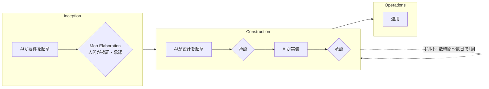

<!-- textlint-disable -->

# はじめに：この記事を読む必要がない人

先に結論から書きます。あなたの組織が以下の2つを満たしているなら、この記事は読まなくていいです。たぶんAI-DLCはうまく回ります。

- 現場に権限があること（決めていいか）
  - 要件を決める会議の場で、技術・法務・セキュリティの判断を「確定」として扱える権限がチームにあること。持ち帰って別部署の承認を取る、上長の決裁を待つ、が発生しないこと
- 現場に能力があること（正しく決められるか）
  - その判断を実際に下せる知識がチームの中にあること。AIが出してきた要件・設計の妥当性をその場で見抜けること

AI-DLCはこの両方が揃っている前提で作られています。AWSが提唱している以上、Amazonの組織構造が暗黙に埋め込まれているからです。

逆に、法務や決裁が別の場所にあって、要件確定に1〜2週間かかるのが常態という"普通の"日本の大企業の方には、この先を読む価値はあるかもしれません。

理由を先に一文で書いておきます。

> AI-DLCは「まだ決めない」を保持する仕組みを削って、前進だけを速くした。戻れる速度は組織の承認リードタイムで決まるので、"普通の"大企業では速度がそのまま未検証の在庫になる。

以下、これを順に説明していきます。

# AI-DLCとは何か（簡単に）

AWSが2025年7月に提唱した開発方法論です。ざっくり描くとこういう流れです。

- 3フェーズ構成：Inception（要件）→ Construction（設計・実装）→ Operations（運用）
- ボルト：スプリントの代わりとなる、数時間〜数日の作業サイクル
- Mob Elaboration：Inceptionでチーム全員がAI生成の要件を検証する儀式
- 承認ゲート：AIが起草し、人間が各ステップを検証してから次に進む

2025年11月にワークフローがOSS化され、Claude Code、Kiro、Cursor などで動きます。実体は方法論とルールファイル群であって、AWSのサービスではありません。re:Invent 2025では10〜15倍の生産性向上が主張されていますが、独立した検証データは現時点でほぼ存在しません。

- [AI-Driven Development Life Cycle（AWS DevOps Blog）](https://aws.amazon.com/blogs/devops/building-with-ai-dlc-using-amazon-q-developer)
- [awslabs/aidlc-workflows（オープンソース実装）](https://github.com/awslabs/aidlc-workflows)
- [AWS re:Invent 2025 - Introducing AI driven development lifecycle (DVT214)](https://www.youtube.com/watch?v=1HNUH6j5t4A)

# 1. 承認ゲートは、情報がない時点で決定を要求する

実際に回してみて、一番の問題だと思ったのがここです。

「ユーザーにメールで通知する」という要件があったとして、Inceptionでこれを承認したとします。文としては完結しているので、普通に通ります。でも、その時点では判断がつかないことが山ほど隠れています。

- 送信基盤はどれを使う？ 社内に使っていいものがある？
- 送っていい相手なのか？ オプトアウトの扱いは？ 法務確認は？
- メールアドレスをこのシステムが持っていいのか？

これらは詳細化して初めて表面化します。「メールで通知する」という一文からは欠けている箇所が見えないので、承認する側は止めようがないです。抽象的な記述ほど承認しやすく、承認しやすいほど承認に意味がない、という逆相関があります。

しかも順序が逆です。上流ほど判断材料が少なく、下流ほど揃うのに、承認の重みは上流ほど大きい。判断材料が最も少ない時点の署名が、最も広い範囲を拘束することになります。優秀な人を揃えても、材料がない時点の判断は当たりません。

# 2. だから「まだ分からない」を置く場所がなく、戻れなくなる

開発には「今はまだ分からない」ことが必ずあります。問題は、AI-DLCにはそれを分からないまま持ち回る場所がないことです。承認ゲートの出口は「承認済み」か「未承認」しかないので、「分からない」は承認済みに丸められます。

メールの例で追うとこうなります。

- Inception：「メールで通知する」を承認。送っていい相手かどうかはまだ誰も確認していないが、要件としては確定扱いになる
- Construction：設計も実装も「メールは送れる」前提で積み上がる
- 実装の途中：「あれ、この通知対象、法務的に送っていい相手じゃなくない？」と気づく

方法論上は前のフェーズに戻れることになっています。でも実際は戻りません。戻る先が承認済みなので撤回は「誰かの署名を否定する」意味を帯びるし、戻すとその上に積まれた下流の成果物も巻き添えで無効になるからです。結果、要件を撤回する方向ではなく、「送れない相手には送らないフラグを足そう」のように実装側で辻褄を合わせる方向に力が働きます。

これまでの方法論はどれも、「まだ分からない」の置き場を持っていました。

| 方法論             | 「まだ分からない」の置き場                                           |
| ------------------ | -------------------------------------------------------------------- |
| ウォーターフォール | 前提条件表・課題管理表。フェーズの外側に未解決事項を持ち回る         |
| アジャイル         | 反復そのもの。決めないでおくために、次の周で戻ってくる               |
| 人間主導の開発全般 | 設計者の頭の中。文書に書いてなくても「ここまだ怪しい」を保持している |

AIが下流を回すと、この最後の「頭の中の保持者」がいなくなります。AI-DLCは速度を上げるためにこの機構を削ぎ落として、代替を用意していません。ボルトが短いから反復型だ、という言い分もあるでしょうが、周の中で確定させたものが次の周に持ち越されるなら、それは反復ではなく分割納品だと思います。

# 3. 戻れないまま速度を上げると、未検証の在庫が膨らむ

戻れない構造に速度を足すとどうなるか。

「メールで通知する」を1つだけ実装してリリースまで持っていけば、「送れないじゃん」となった時点で取り下げられます。傷が浅いです。ところが「メール内のリンクから詳細画面に遷移できる」のような要件が束になっていると、一本抜くと他が崩れるので抜けなくなります。アジャイルの反復は、周期の話というより、この「安く捨てられる単位を保つ」ための仕組みだったのだと思います。

そしてAIによる高速化は、この束を大きくする方向に効きます。人間だけでやっていた頃は「全部書くのは大変だから、まず一本通そう」という物理的な制約が上限として効いていました。要件を詰めるコストが下がると、詰められるだけ詰めてしまいます。ボルトで時間は短くしたけれど、一周で扱う範囲は縮めていないです。

順序を保ったまま速度だけ上げると、検証されないまま積み上がる量が増えます。ウォーターフォールの本質的な課題はこれだと思っています。

# 4. その在庫を捌く速度は、組織の承認リードタイムで決まる

ここからが本題です。3章までの話は、組織条件次第で緩和されます。要件を1時間で全部決めて、その日のうちに実装まで通せるなら、「送れませんでした」となってもその日のうちなので傷が浅いです。

問題は、"普通の"大企業がそういう組織ではないことです。

Mob Elaborationは、全員が同席して即断できる想定です。でも多くの大企業では、法務も情シスもセキュリティも別部署で、判断は問い合わせフローに乗ります。その場で返事できる人がそもそもいない。アジャイルが「顧客が同席していること」を前提にして、実際には多くの現場で成立しなかったのと同じ構図です。

すると、ボルトが数時間〜数日なのに、法務確認に2週間かかる。承認待ちで止めるか、待たずに進むかの二択になって、実際には後者が選ばれます。仮承認で進んで、後から法務がNGを出したときには、その上に2週間分の設計と実装が積み上がっています。承認ゲートは空回りするのではなく、形式だけ満たした承認を量産する方向に壊れます。

そしてこの2週間は、方法論では縮まりません。組織の権限配置で決まっているからです。導入可否を分けるのは、案件のドメインでも生成物の品質でもなく、一周を回すのに必要な承認の実所要時間だと思います。

# 5. じゃあどうするか

ここまでの問題は2つに集約できます。「戻れないこと」と「承認が遅いこと」です。後者は組織の問題なので方法論では直せません。なので対策は、前者を直すか、後者に巻き込まれないようにするか、のどちらかになります。

## 戻れるようにする：撤退条件を先に書く

着手時点で降りる条件を書いておきます。

> 通知対象にメールを送ってよいか法務未確認。不可なら本件は取り下げ。

ここまで書いてあれば、後半で判明したときに撤退が既定路線として発動します。「費用対効果が悪いからやめる」は事後だと必ず主観になるので、先に書いておくのが肝です。あわせて、2週間で無理と分かって降りたのは3ヶ月溶かさなかった成果だ、と組織として数えること。

## 戻れるようにする：「仮置き」を状態として持つ

承認を「OK / NG」の二値にせず、「仮置き」を第三の状態として持たせます。仮置きのまま下流に流してよいが、仮置きに依存した箇所には印が付いて、後で情報が揃ったときにそこだけ再訪できる。人間が頭の中でやっていた「決めないでおく」を、方法論側に持たせるということです。

## 承認に巻き込まれないようにする：工程を切って疎結合に並べる

全体を一本のフローに乗せるのではなく、要所要所を独立に回します。

- ブレストは、間違っていても捨てるだけ → 任せていい
- ログ集計から課題抽出は、入力も出力も検証可能 → 自動化できる
- 要件確定は、判定者が社外・他部署にいる工程 → 自動化から外す

工程単位で独立していれば、法務確認に2週間かかっても他が止まりません。承認ゲート方式は全部を一本の依存関係に載せるから、遅い部署が全体を律速します。ただし成功すると必ず「繋げれば端から端まで自動化できるのでは」という圧が来るので、繋がないことを意図的な設計判断として言語化しておいたほうがいいです。

# 6. 導入するなら、リードタイムの内訳を測ってから

全ベットが危険というのは、方法論の良し悪しと別に、判断材料がない段階だからというのが大きいです。AWSの10〜15倍は自己申告で独立した検証はなく、一方で全否定も同じくらい根拠が薄いです。

なので、まず測ることをおすすめします。案件ごとに着手から完了までを、生成・レビュー・承認待ち・手戻りの4つに分けて記録します。

リードタイムは最も遅い工程に律速されます。要件確定に1〜2週間かかる組織なら、遅いのはそこです。生成が10倍速くなっても、詰まる場所が変わらないなら全体は縮まりません。むしろ生成だけ速くすると待ち行列に仕掛品が積み上がり、その間に前提が古くなって後半で手戻るので、伸びる可能性すらあります。

おそらく生成は全体の1割にも満たないはずです。その数字が出れば、「AI-DLCが悪い」ではなく「うちのリードタイムだとこの方法論の前提が満たせない」という話にできます。方法論の否定ではなく適用条件の話になるので、推進側とも噛み合うはずです。

# まとめ

- AI-DLCの「AIと共に開発する」という基本思想は正しい。要所要所で効く部品は確実にある
- ただし承認ゲートは判断材料が揃う前に判断を要求するので、「まだ分からない」を保持できず、戻れなくなる
- 戻れない構造に速度を足すと、未検証の在庫が積み上がる
- 在庫を捌く速度は組織の承認リードタイムで決まる。方法論にAmazonの組織構造が埋め込まれている
- 導入するなら全ベットではなく、リードタイムの内訳を測ってから範囲を決める

AI-DLCは、フローとしてではなくカタログとして読むのが正しいのかもしれません。個々の部品は他の文脈でも使えます。

<!-- textlint-enable -->
